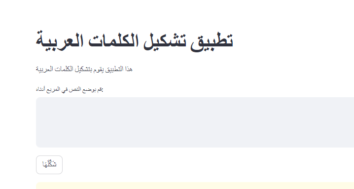

# Arabic_tashkeel
# Tashkeel App - Arabic Text Tashkeel and Pronunciation Aid

## Description

Tashkeel App is a simple web application built using Streamlit that helps users add Tashkeel (Arabic diacritics) to Arabic text. Tashkeel is the process of adding diacritical marks, such as short vowel marks, to Arabic words to indicate correct pronunciation.

The app allows users to input Arabic text, and with a click of a button, it automatically adds Tashkeel to the text using the `mishkal.tashkeel` library. This feature aids Arabic learners, teachers, and readers in understanding the pronunciation of the words and enhances their language learning experience.

## Features

- Add Tashkeel (diacritical marks) to Arabic text.
- Easy-to-use interface with a text input area and a single button for Tashkeel generation.
- Instantly displays the Tashkeel-added text below the button.
- Provides feedback if the input text is empty, prompting the user to enter some text.
- Built on Streamlit, allowing for rapid web application development and deployment.

## Usage

1. Enter your Arabic text in the "Enter your text for Tashkeel" text area.
2. Click the "Add Tashkeel" button to add Tashkeel to the entered text.
3. The app will process the input text and display the Tashkeeled text below the button.
4. If the input text area is empty, the app displays a warning message to enter some text.
